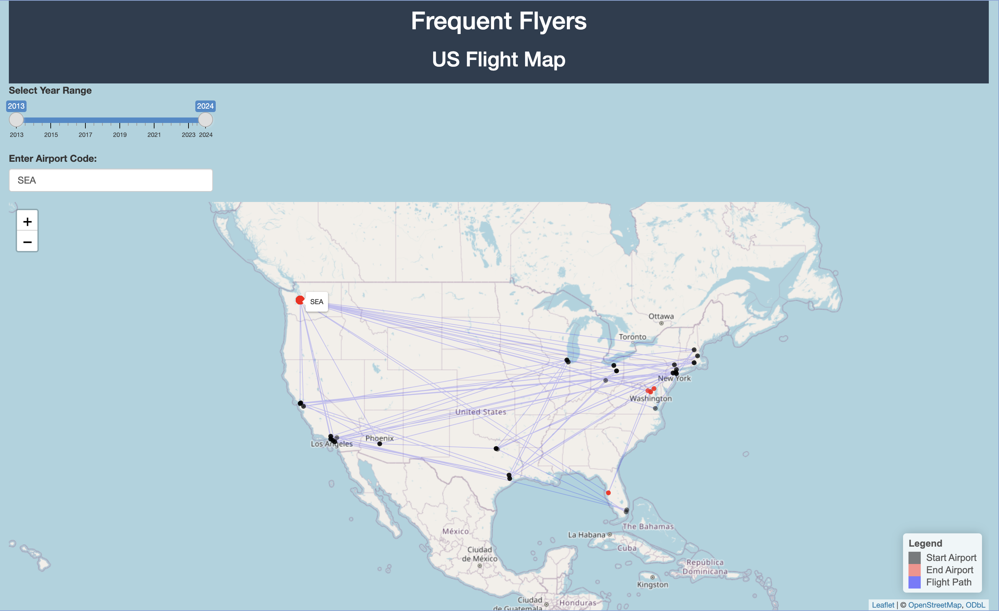
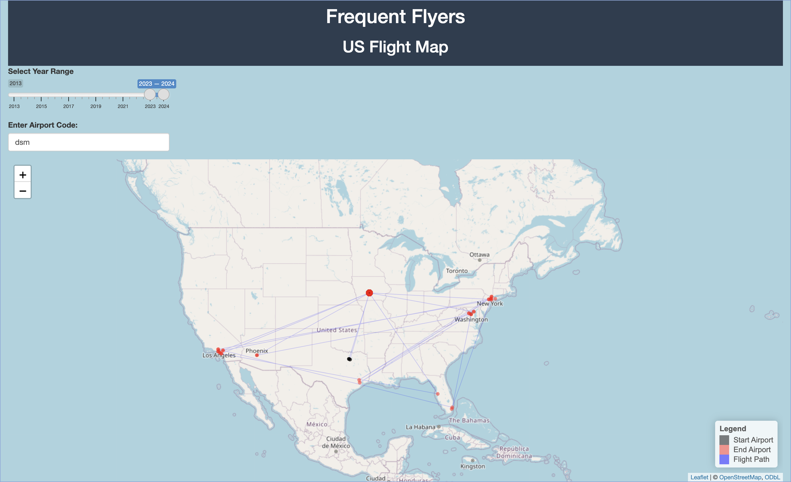

---
---
---

# Frequent Flyers

## 2/17/2025 Update

As of 2/17 we have a basic interactive map developed. We are using Leaflet with the OpenStreetMaps Base layer for rendering. We are using R shiny for the front-end functionality.

We decided to use R for this project over Python due to the package support for geospatial data science within R, as well as the easy web integration with Shiny.

### Current Features

Currently a user is able to hover over an airport and see the airport code. There is a slider that allows the user to view flights in a range of years between 2013-2024. It can also take user input to filter to flights to show only a given airport.

### Roadblocks

Our largest current roadblock is incomplete data. The data set we have been using does not have every flight, as can be seen above. The DSM airport connects to about a dozen other airports according to the data set, but in reality should have flights to most major airports. We have been looking into pulling live data using an API, however we have found that the fees associated with many are beyond the budget of this project. We are also constrained by the GitHub file size limit, which we are getting around by constraining the data set to only domestic flights since 2013.

Another major roadblock we have encountered is the time associated with each flight is reported quarterly, instead of in a date-time format. This will likely cause issues down the line as we get into our modeling. While we still will be able to create visualizations of flight prices, it will be difficult to do prediction tasks. The low resolution of data may skew pricing data, particularly in Q4 when there are a few days when many people travel, which could inflate the entire quarter.

Finally, the site is not optimized for mobile devices. We will have to look into dynamically sizing UI elements based on the screen size, as well as potentially redesigning the UI entirely to work with mobile devices.

### Next Steps

We intend to add a machine learning component to this dashboard. We will probably use gradient boosted trees for pricing predictions.

We also plan on adding another page to the site with interactive plots.

If we are able to find a free API we would prefer to update the data to be pulled dynamically as opposed to using CSV files to ensure more recent and complete data.
